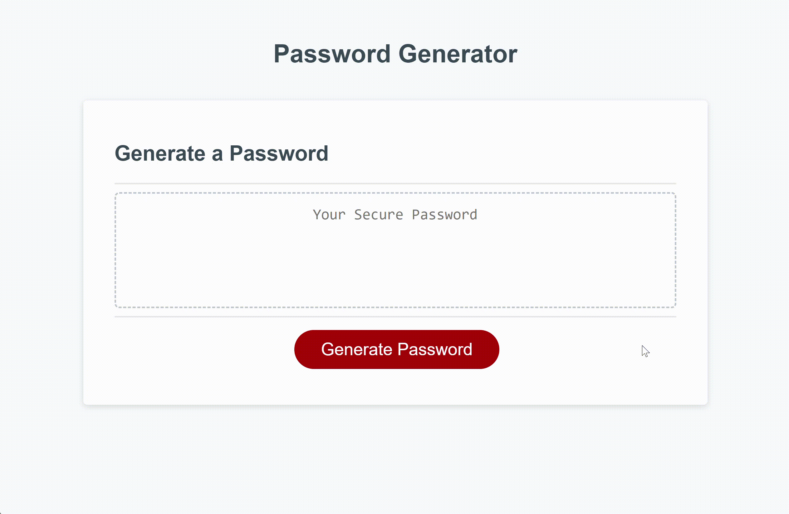

# Password Generator
An application that generates random passwords based on provided criteria.

## Technology Used 

| Technology Used         | Resource URL           | 
| ------------- |-------------| 
| JavaScript    | [https://developer.mozilla.org/en-US/docs/Web/JavaScript](https://developer.mozilla.org/en-US/docs/Web/JavaScript) | 
| HTML    | [https://developer.mozilla.org/en-US/docs/Web/HTML](https://developer.mozilla.org/en-US/docs/Web/HTML) | 
| CSS     | [https://developer.mozilla.org/en-US/docs/Web/CSS](https://developer.mozilla.org/en-US/docs/Web/CSS)      |   
| Git | [https://git-scm.com/](https://git-scm.com/)     |    

## Description
[Password Generator](https://dee-here.github.io/password-generator/)

This project was to modify starter code to create an application that generates random passwords based on criteria provided to the application.
Starter code included a JavaScript file where I could write code to get the desired output.

Logic to generate password:
* Prompt the user for a password length.
* Validate password length. It should be between 8 and 128.
* If password length is valid continue to get password criteria from user, else alert user to try again and stop.
* Get password criteria from user. Password criteria specifies if password should include uppercase, lower case, special characters and/or numbers.
* Validate password criteria entered by user. User should include atleast one type of characters, else alert user to try again and stop.
* If password criteria is valid, generate an array with all the characters that the user wants to include in the password.
* Using a random index generator, copy the number of characters needed in the password from the array created in the previous step to an array called passwordArray.
* Convert this passwordArray into a string and display it in the text box.

## Usage
Click on the red "Generate Password" button to get started.

Enter a password length when prompted. Password length needs to be between 8 and 128.

Follow the prompts to provide password criteria. If valid criteria is entered, the applciation generates a new password and displays it in the text box.

Click on the red "Generate Password" to try again.

## Learning points
Here are a few things that I learnt while working on this project.

JavaScript Alert box, Confirm box and Prompt can be used to display pop up dialogs and accept user inputs.
Array map function and arrow functions are very useful to modify data.
Use \ to escape special characters in JavaScript.

Math.random returns a random number between 0 and upto 1. 
Math.floor rounds down and returns the largest integer less than or equal to a given number. 

Spread operator is very useful to copy arrays.

## Screen Recording

## Author Info

Deepak Sinha

* [Portfolio](https://dee-here.github.io/portfolio/)
* [Github](https://github.com/dee-here)

## License

MIT License

Copyright (c) [2023] [deepak sinha]

Permission is hereby granted, free of charge, to any person obtaining a copy
of this software and associated documentation files (the "Software"), to deal
in the Software without restriction, including without limitation the rights
to use, copy, modify, merge, publish, distribute, sublicense, and/or sell
copies of the Software, and to permit persons to whom the Software is
furnished to do so, subject to the following conditions:

The above copyright notice and this permission notice shall be included in all
copies or substantial portions of the Software.

THE SOFTWARE IS PROVIDED "AS IS", WITHOUT WARRANTY OF ANY KIND, EXPRESS OR
IMPLIED, INCLUDING BUT NOT LIMITED TO THE WARRANTIES OF MERCHANTABILITY,
FITNESS FOR A PARTICULAR PURPOSE AND NONINFRINGEMENT. IN NO EVENT SHALL THE
AUTHORS OR COPYRIGHT HOLDERS BE LIABLE FOR ANY CLAIM, DAMAGES OR OTHER
LIABILITY, WHETHER IN AN ACTION OF CONTRACT, TORT OR OTHERWISE, ARISING FROM,
OUT OF OR IN CONNECTION WITH THE SOFTWARE OR THE USE OR OTHER DEALINGS IN THE
SOFTWARE.